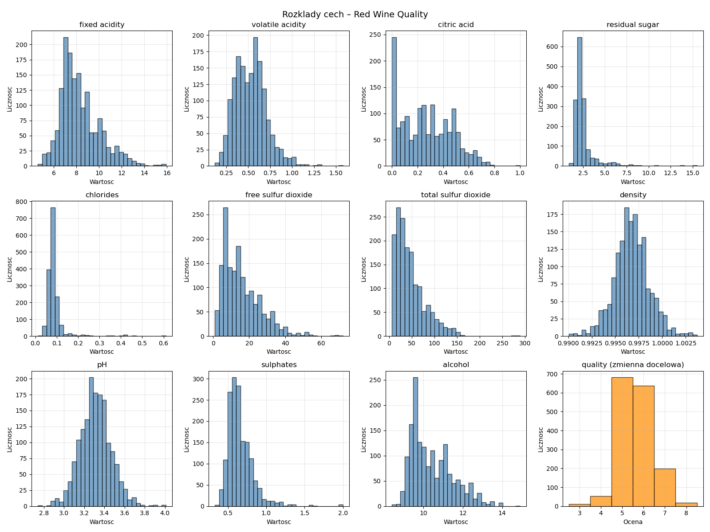
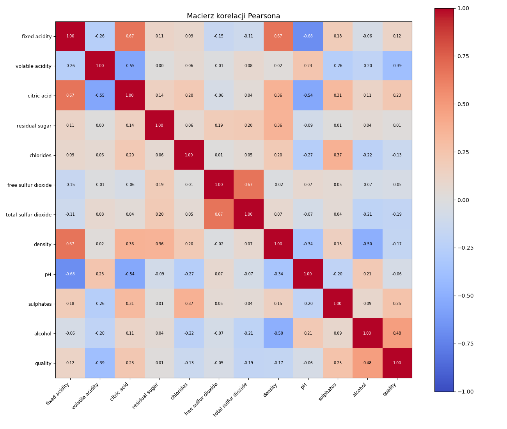
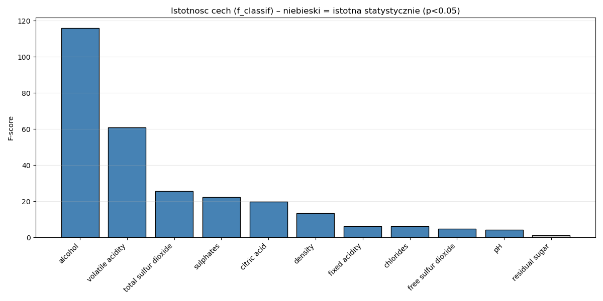
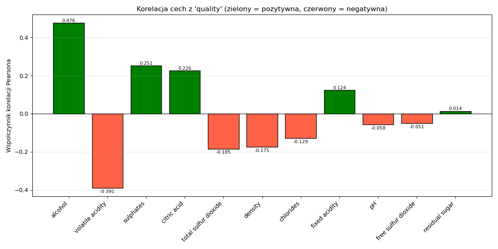

# Etap 1 – Analiza i wizualizacja zbioru danych Red Wine Quality

## Zbiór danych

Plik: `winequality-red.csv`  
Źródło: Kaggle

Zbiór opisuje właściwości fizykochemiczne czerwonych win oraz ich subiektywną ocenę jakości (wystawianą przez sommelier w skali 0–10). Zawiera **1599 próbek** i **11 cech wejściowych** oraz jedną zmienną docelową `quality`.

| Cecha | Opis |
|---|---|
| fixed acidity | kwasowość stała (g/dm³) |
| volatile acidity | kwasowość lotna – duże wartości = ocet (g/dm³) |
| citric acid | kwas cytrynowy – świeżość i smak (g/dm³) |
| residual sugar | pozostały cukier po fermentacji (g/dm³) |
| chlorides | zawartość soli (g/dm³) |
| free sulfur dioxide | wolny SO₂ – konserwant (mg/dm³) |
| total sulfur dioxide | całkowity SO₂ (mg/dm³) |
| density | gęstość wina (g/cm³) |
| pH | kwasowość pH |
| sulphates | siarczany – konserwant i aromaty (g/dm³) |
| alcohol | zawartość alkoholu (% obj.) |
| **quality** | **ocena jakości (3–8), zmienna docelowa** |

---

#### Kod 1 — Analiza zbioru danych

Wczytuje plik CSV z danymi o winie i wypisuje podstawowe informacje: ile jest próbek i cech, jak rozkładają się oceny jakości (ile win ma ocenę 5, 6, 7 itd.) oraz podstawowe statystyki dla każdej cechy (średnia, odchylenie, min, max, kwartyle).

**Rozkład klas:**

| Jakość | Liczba próbek | Udział |
|--------|--------------|--------|
| 3 | 10 | 0.6% |
| 4 | 53 | 3.3% |
| 5 | 681 | 42.6% |
| 6 | 638 | 39.9% |
| 7 | 199 | 12.4% |
| 8 | 18 | 1.1% |

Zbiór jest silnie niezbalansowany — klasy 5 i 6 stanowią łącznie ponad 82% próbek, natomiast klasy skrajne (3 i 8) są mocno niedoreprezentowane.

**Podstawowe statystyki cech:**

| Cecha | mean | std | min | 25% | 50% | 75% | max |
|---|---|---|---|---|---|---|---|
| fixed acidity | 8.320 | 1.741 | 4.600 | 7.100 | 7.900 | 9.200 | 15.900 |
| volatile acidity | 0.528 | 0.179 | 0.120 | 0.390 | 0.520 | 0.640 | 1.580 |
| citric acid | 0.271 | 0.195 | 0.000 | 0.090 | 0.260 | 0.420 | 1.000 |
| residual sugar | 2.539 | 1.409 | 0.900 | 1.900 | 2.200 | 2.600 | 15.500 |
| chlorides | 0.087 | 0.047 | 0.012 | 0.070 | 0.079 | 0.090 | 0.611 |
| free sulfur dioxide | 15.875 | 10.457 | 1.000 | 7.000 | 14.000 | 21.000 | 72.000 |
| total sulfur dioxide | 46.468 | 32.885 | 6.000 | 22.000 | 38.000 | 62.000 | 289.000 |
| density | 0.997 | 0.002 | 0.990 | 0.996 | 0.997 | 0.998 | 1.004 |
| pH | 3.311 | 0.154 | 2.740 | 3.210 | 3.310 | 3.400 | 4.010 |
| sulphates | 0.658 | 0.169 | 0.330 | 0.550 | 0.620 | 0.730 | 2.000 |
| alcohol | 10.423 | 1.065 | 8.400 | 9.500 | 10.200 | 11.100 | 14.900 |

---

#### Kod 2 — Histogramy

Rysuje 12 wykresów słupkowych (po jednym na każdą cechę) które pokazują jak rozłożone są wartości każdej cechy — czyli czy większość win ma niską, średnią czy wysoką kwasowość, alkohol itd. Ostatni wykres pokazuje rozkład ocen jakości. Zapisuje wynik do pliku PNG.

---

#### Kod 3 — Macierz korelacji

Oblicza i rysuje macierz 12×12 gdzie każda komórka pokazuje jak silnie dwie cechy są ze sobą powiązane. Czerwony kolor oznacza silną korelację dodatnią, niebieski ujemną. Pozwala wykryć np. że dwie cechy mówią praktycznie to samo.

---

#### Kod 4 — Istotność cech (F-score)

Sprawdza które cechy mają największy wpływ na ocenę jakości wina używając testu F. Wypisuje ranking cech od najważniejszej do najmniej ważnej oraz rysuje wykres słupkowy — niebieski słupek oznacza cechę istotną statystycznie, szary nieistotną.

---

#### Kod 5 — Korelacja Pearsona z quality

Oblicza jak każda cecha jest powiązana z oceną jakości i w którą stronę. Zielony słupek oznacza że im więcej tej cechy tym lepsza jakość (np. alkohol), czerwony że im więcej tym gorsza (np. lotna kwasowość). Cechy posortowane są od najsilniejszego powiązania.

---

#### Kod 6 — Test Shapiro-Wilka

Sprawdza czy wartości każdej cechy mają rozkład normalny (kształt dzwonu). Wypisuje dla każdej cechy statystykę testową, p-value i odpowiedź TAK/NIE. Ta wiedza mówi które metody ML można bezpiecznie zastosować na danych.

**Wyniki (α = 0.05):**

| Cecha | statistic | p-value | Normalny? |
|---|---|---|---|
| fixed acidity | 0.9420 | ~0.000000 | NIE |
| volatile acidity | 0.9743 | ~0.000000 | NIE |
| citric acid | 0.9553 | ~0.000000 | NIE |
| residual sugar | 0.5661 | ~0.000000 | NIE |
| chlorides | 0.4842 | ~0.000000 | NIE |
| free sulfur dioxide | 0.9018 | ~0.000000 | NIE |
| total sulfur dioxide | 0.8732 | ~0.000000 | NIE |
| density | 0.9909 | ~0.000000 | NIE |
| pH | 0.9935 | 0.000002 | NIE |
| sulphates | 0.8330 | ~0.000000 | NIE |
| alcohol | 0.9288 | ~0.000000 | NIE |

Żadna z cech nie ma rozkładu normalnego (p < 0.05 dla wszystkich). Oznacza to, że metody zakładające normalność rozkładu (np. LDA, naiwny klasyfikator Bayesa z założeniem Gaussa) mogą dawać gorsze wyniki. Wskazane jest stosowanie metod nieparametrycznych lub odpornych na ten warunek.

